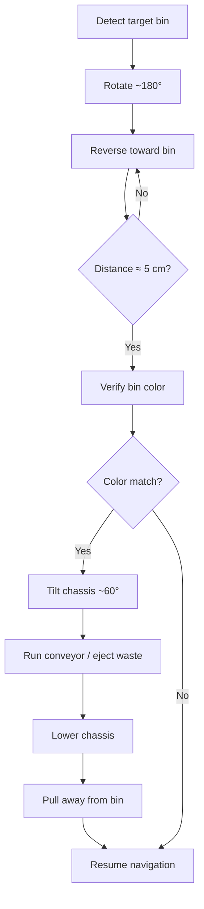

# Autonomous Waste-Sorting Mobile Manipulator (ROS 2 Jazzy)

An autonomous waste-sorting Automated Guided Vehicle (AGV) built on a two-tier control architecture: a **Raspberry Pi 5** running ROS 2 Jazzy handles high-level autonomy (computer vision, LiDAR, path planning), while an **ESP32-S3** acts as the low-level hardware bridge over micro-ROS, driving motors, actuators, and sensors in real time.

## Contents

- [Hardware Architecture](#hardware-architecture)
- [Pin Mapping](#pin-mapping-pinsh)
- [Software Dependencies](#software-dependencies)
- [Installation \& Flashing](#installation--flashing)
- [Running the System](#running-the-system)
- [System Usage](#system-usage)
- [Autonomous Mode](#autonomous-mode)
- [ROS 2 Topics](#ros-2-topics)
- [Debugging \& Troubleshooting](#debugging--troubleshooting)
- [Project Structure](#project-structure)
- [System Components](#system-components)
- [Safety](#safety)
- [License](#license)

## Hardware Architecture

| Layer | Component | Role |
|---|---|---|
| High-level | Raspberry Pi 5 (Ubuntu, ROS 2 Jazzy) | Computer vision, LiDAR, path planning |
| Low-level | ESP32-S3 DevKit | Real-time motor, sensor, and actuator control via micro-ROS |
| Drive | 4× DC motors, 2× DRV8833 drivers, hardware quadrature encoders | Skid-steer locomotion |
| Ejection | 28BYJ-48 stepper (conveyor) + dump servo | Waste ejection into detected bin |
| Perception | TCS34725 I2C color sensor, rear distance sensor, Pi Camera / LiDAR | Waste ID, docking, navigation |
| Camera gimbal | 2× servos (pan/tilt) | Camera aiming |

## Pin Mapping (`pins.h`)

All GPIO assignments below are fixed to avoid ESP32-S3 timer conflicts and to keep clear of the pins reserved for Octal PSRAM/Flash on this module.

| Subsystem | Signal | GPIO |
|---|---|---|
| DRV8833 — FL | IN1, IN2 | 4, 5 |
| DRV8833 — FR | IN1, IN2 | 6, 7 |
| DRV8833 — RL | IN1, IN2 | 15, 16 |
| DRV8833 — RR | IN1, IN2 | 12, 11 |
| Encoder — FL | A, B | 17, 18 |
| Encoder — FR | A, B | 40, 39 |
| Encoder — RL | A, B | 9, 10 |
| Encoder — RR | A, B | 35, 21 |
| Stepper (ULN2003) | IN1–IN4 | 41, 42, 2, 1 |
| Servos | Pan, Tilt, Dump | 36, 37, 38 |
| I2C sensor | SDA, SCL | 47, 48 |

> **Check before wiring:** GPIO35–37 are used internally for Octal PSRAM data lines on ESP32-S3 modules built with `psram_type = opi` (as in the `platformio.ini` below). If your board uses Octal PSRAM, verify against the datasheet whether GPIO35 (encoder RR-A) and GPIO36/37 (pan/tilt servos) are actually free before relying on this table — reusing PSRAM pins for GPIO can cause boot failures or memory corruption on some modules.

## Software Dependencies

### ESP32-S3 (PlatformIO)

```ini
[env:esp32-s3-devkitc-1]
platform = espressif32
board = esp32-s3-devkitc-1
framework = arduino
monitor_speed = 115200

lib_deps =
    https://github.com/micro-ROS/micro_ros_platformio
    madhephaestus/ESP32Encoder @ ^0.11.3
    madhephaestus/ESP32Servo @ ^3.0.5
    waspinator/AccelStepper @ ^1.64
    adafruit/Adafruit TCS34725 @ ^1.4.4

build_flags =
    -D ARDUINO_USB_CDC_ON_BOOT=0
```

### ROS 2 (Raspberry Pi 5 / WSL)

ROS 2 Jazzy must be installed on the host (Raspberry Pi 5 or an Ubuntu/WSL machine).

Install the WebSocket bridge required by the HTML dashboard:

```bash
sudo apt update
sudo apt install ros-jazzy-rosbridge-suite -y
```

Source the ROS 2 environment:

```bash
source /opt/ros/jazzy/setup.bash
```

Optionally, add this to `~/.bashrc` so it's sourced automatically in every new shell:

```bash
echo "source /opt/ros/jazzy/setup.bash" >> ~/.bashrc
source ~/.bashrc
```

## Installation & Flashing

### 1. Flash the ESP32-S3

Compile and upload `main.cpp` with PlatformIO. The firmware uses the ESP32 hardware **Pulse Counter (PCNT)** peripheral to read motor encoders without blocking the CPU, and the **AccelStepper** library to drive the conveyor stepper non-blockingly — both are what let the board hold a stable micro-ROS session while simultaneously handling drive control, encoder feedback, the conveyor, the pan/tilt and dump servos, sensor reads, and the dead-man safety timeout.

### 2. Set up the Python brain

On the Raspberry Pi 5 (or a test machine), save the autonomy logic as `autonomous_sorter.py` and make it executable:

```bash
chmod +x autonomous_sorter.py
```

This node owns the higher-level behavior: color-based sorting, docking, reverse positioning, bin verification, waste ejection, and navigation state handling.

### 3. Prepare the dashboard

Save `dashboard.html` anywhere on the host. It talks to ROS 2 purely through native browser WebSockets via `rosbridge` — no separate web backend is required.

## Running the System

Bring the robot online from the ROS 2 host (Raspberry Pi 5, Ubuntu PC, or WSL) using three terminals.

**Terminal 1 — micro-ROS hardware bridge.** Connect the ESP32-S3 over USB, then start the serial agent:

```bash
source /opt/ros/jazzy/setup.bash
ros2 run micro_ros_agent micro_ros_agent serial --dev /dev/ttyUSB0 -b 115200
```

If the board enumerates on a different port, replace `/dev/ttyUSB0` accordingly (e.g. `/dev/ttyACM0`).

**Terminal 2 — web dashboard backend.** Start the ROS 2 WebSocket bridge so `dashboard.html` can reach ROS 2 topics:

```bash
source /opt/ros/jazzy/setup.bash
ros2 launch rosbridge_server rosbridge_websocket_launch.xml
```

Data flow: Browser → WebSocket → `rosbridge_server` → ROS 2 → micro-ROS → ESP32-S3.

**Terminal 3 — autonomous brain.** Run the sorting/docking node:

```bash
source /opt/ros/jazzy/setup.bash
python3 autonomous_sorter.py
```

## System Usage

Open `dashboard.html` in a browser for manual control and live telemetry.

- **Telemetry** — encoder ticks, TCS34725 readings with a live color swatch, and robot status.
- **Drive control** — an on-screen D-pad; the drive path is protected by a dead-man's switch that stops the motors if the control link drops.
- **Pan/tilt control** — sliders for manual gimbal positioning during testing and calibration.
- **Actuator testing** — manual control of the dump servo, conveyor belt, and pan/tilt servos; the conveyor is driven via `/conveyor_cmd`.
- **Speed limit** — a slider that caps the ESP32-S3's max velocity at runtime, without recompiling firmware.

## Autonomous Mode

While `autonomous_sorter.py` is running, the robot watches `/trash_color` and executes:

1. **Bin detection** — an external camera/CV node detects the target bin and triggers docking.
2. **Rotation** — the robot turns roughly 180° to face the bin.
3. **Reverse docking** — the robot reverses while the rear distance sensor tracks range, stopping at approximately 5 cm.
4. **Color verification** — the rear TCS34725 checks the bin against the target waste color.
5. **Ejection** — on a match, the chassis tilts to ~60°, the conveyor runs to eject the waste, then stops, and the chassis returns to level.
6. **Departure** — the robot pulls away and resumes navigation.



> The "No" branch on the color check currently routes straight back to navigation; if the intent is to retry, search for a different bin, or flag an error instead, that behavior still needs to be written into `autonomous_sorter.py`.

## ROS 2 Topics

| Topic | Type | Direction | Purpose |
|---|---|---|---|
| `/cmd_vel` | `geometry_msgs/Twist` | Sub | Differential drive command |
| `/pan_tilt_cmd` | `geometry_msgs/Point` | Sub | Camera gimbal command |
| `/dump_cmd` | `std_msgs/Float32` | Sub | Dump servo angle |
| `/conveyor_cmd` | `std_msgs/Float32` | Sub | Conveyor stepper target speed |
| `/encoders` | `std_msgs/Int32MultiArray` | Pub, 20 Hz | Wheel encoder counts `[FL, RL, FR, RR]` |
| `/trash_color` | `geometry_msgs/Vector3` | Pub, 10 Hz | Raw R/G/B from the color sensor |

## Debugging & Troubleshooting

**ROS 2 diagnostics:**

```bash
ros2 node list
ros2 topic list
ros2 topic echo /trash_color
ros2 topic info /trash_color
```

The micro-ROS agent terminal should show traffic once the ESP32-S3 connects successfully.

**Serial port issues.** If `/dev/ttyUSB0` doesn't exist:

```bash
ls /dev/ttyUSB*
ls /dev/ttyACM*
lsusb
```

If the port exists but access is denied, add your user to `dialout` (log out/in to apply):

```bash
sudo usermod -a -G dialout $USER
```

## Project Structure

```text
autonomous-waste-sorter/
├── firmware/
│   ├── platformio.ini
│   ├── src/
│   │   └── main.cpp
│   └── include/
│       └── pins.h
├── ros2/
│   └── autonomous_sorter.py
├── dashboard/
│   └── dashboard.html
└── README.md
```

## System Components

| Component | Responsibility |
|---|---|
| ESP32-S3 | Low-level, real-time hardware control |
| Raspberry Pi 5 / WSL | ROS 2 host and high-level processing |
| micro-ROS | ESP32 ↔ ROS 2 communication bridge |
| ROS 2 Jazzy | Robot middleware |
| rosbridge | Browser ↔ ROS 2 communication |
| `autonomous_sorter.py` | Autonomous sorting and docking logic |
| `dashboard.html` | Manual control and telemetry UI |
| TCS34725 | Color detection |
| Rear distance sensor | Docking distance measurement |
| Motor encoders | Position / movement feedback |
| External camera | Bin detection, computer vision |
| AccelStepper | Non-blocking conveyor stepper control |
| ESP32 PCNT | Hardware encoder pulse counting |

## Safety

- Dead-man's switch on drive control.
- Automatic motor stop on communication loss.
- Distance-based docking termination.
- Color verification gate before waste ejection.
- All actuator commands routed through ROS 2, not direct GPIO access.

**Before the first full autonomous run, lift the wheels off the ground and reduce the speed limit from the dashboard.**

## License

Copyright © 2026. 